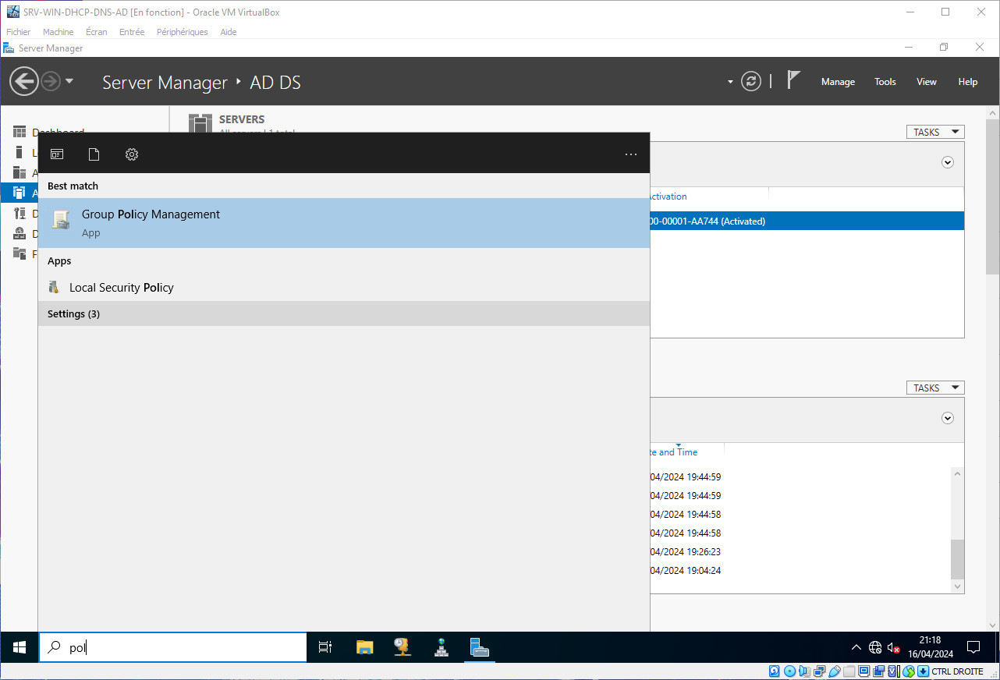

# AD : Exemple de GPO

## Désactivation du Panneau de Configuration Windows

Nous allons dans un premier temps ouvrir le `Group Policy Management`

Déployez l'abrorescence de votre forêt jusqu'à voir votre Unité Organisationnelle

Clique-droit sur votre Unité Organisationnelle puis `Create a GPO in this domain and Link it here`

Reamplissez le champ `Name` puis cliquez sur `OK`

Clique-droit sur votre GPO puis `Edit`

Cliquez sur `User Configuration`

Cliquez sur `Policies`

Cliquez sur `Administration Templates`

Cliquez sur `Control Panel`

Sélectionnez `Prohibit access to Control Panel and PC Settings`

Sélectionnez l'option `Enabled` puis cliquez sur `Apply` puis `OK`

L'accés au Panneau de Configuration Windows est désormais bloqué pour les Utilisateur de l'Unité Organisationnelle

La nouvelle GPO apparait bien dans le Group Policy Managment pour notre Unité

