# AD: Les Unités Organisationnelles

Dans un premier temps, il nous faut accéder au Centre d'Administration AD, vous y avez accés en faisant une recherche dans la barre Windows

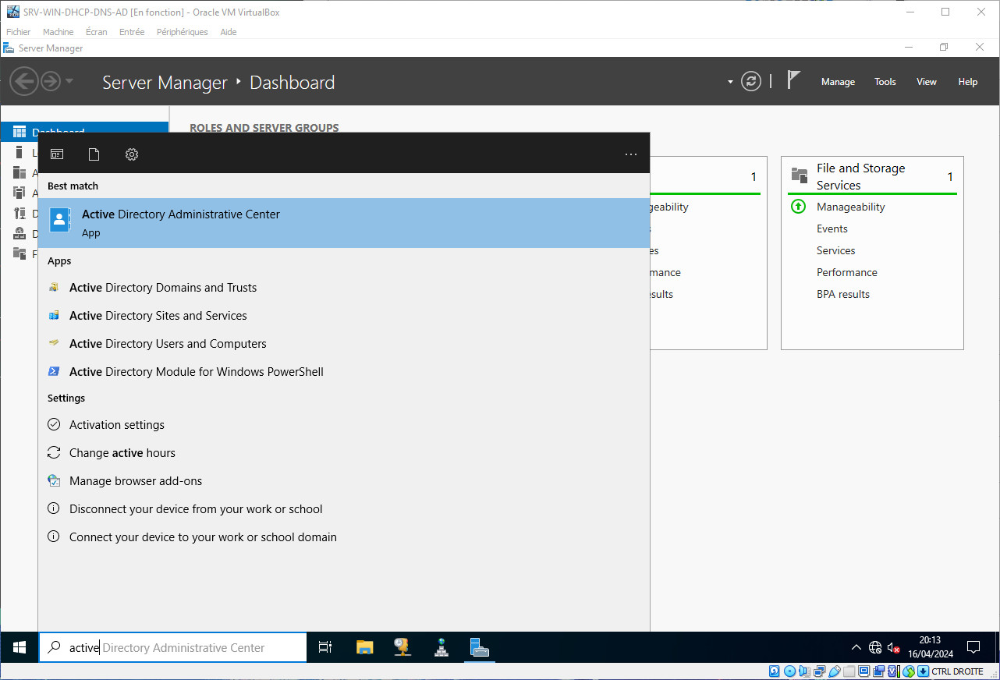

Sélectionnez la ligne de notre Domains AD, ici `wilders`

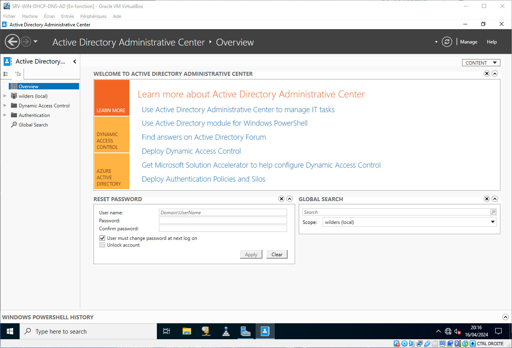

Il faut tout d'abord créer une Unité Organisationnelle

Cliquez sur `New` puis `OrganisationUnit`

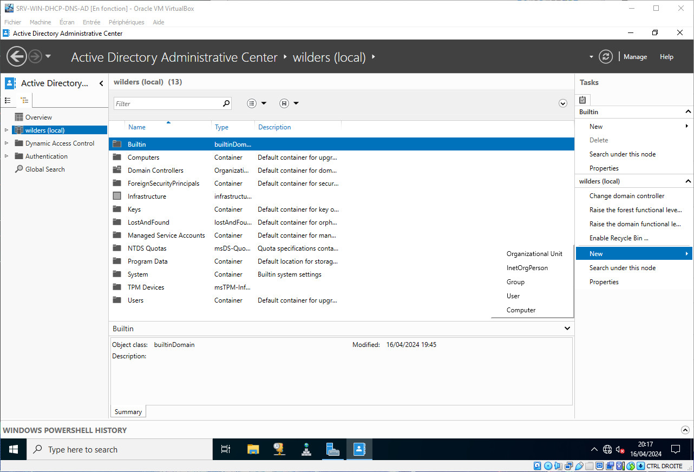

Remplissez le champ `Name`, dans notre cas `Wilders_students` puis `OK`

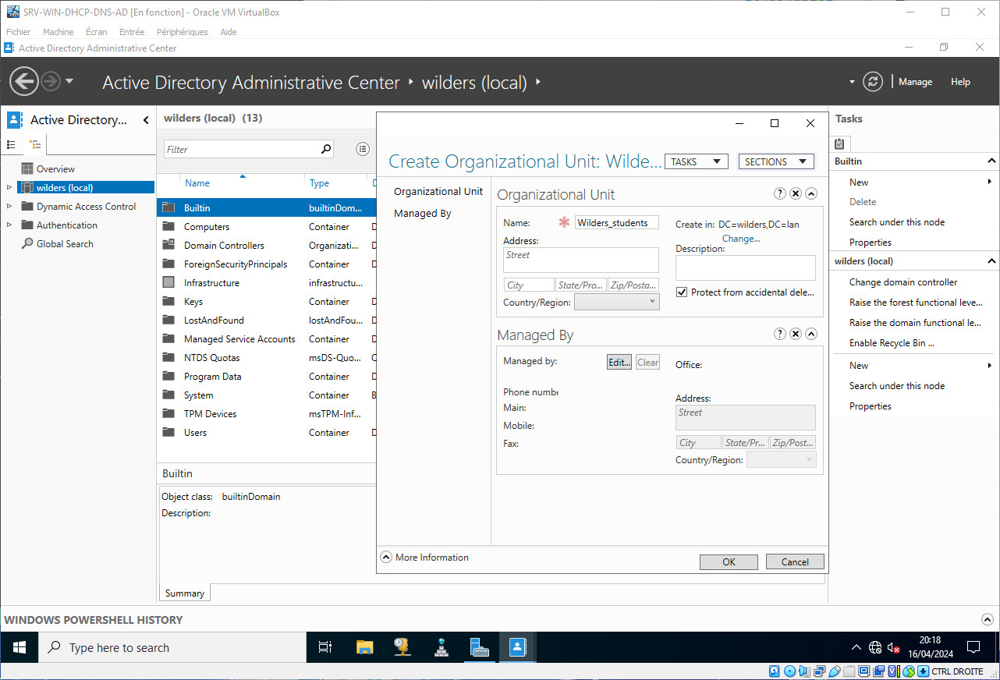

Nous allons ensuite ajouter un Groupe d'Utilisateurs

Clique-droit sur votre Unité Organisationnelle, puis `New` puis `Group`

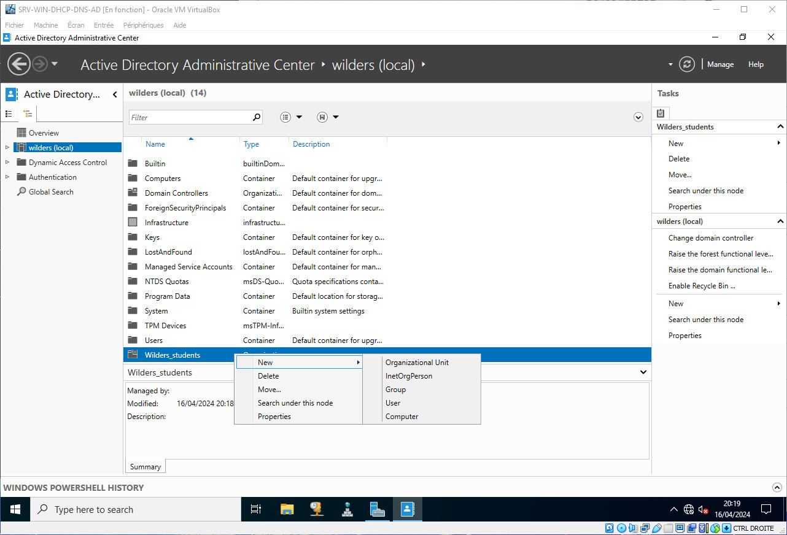

Remplissez les champs `Group name` et `Group SAM`, ici nous mettons `Students` puis `OK`

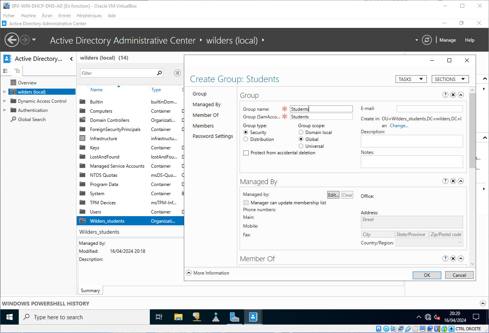

Nous allons enfin ajouter un utilisateur

Clique-droit sur `New` puis `User`

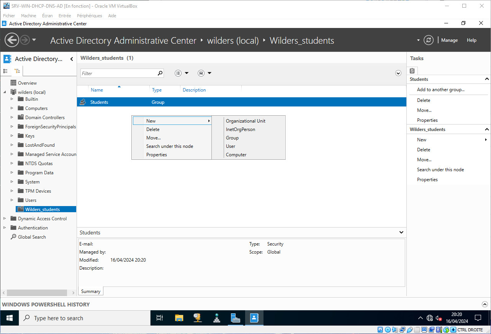

Remplissez les champs `Full name` et `User SAM` puis `OK`

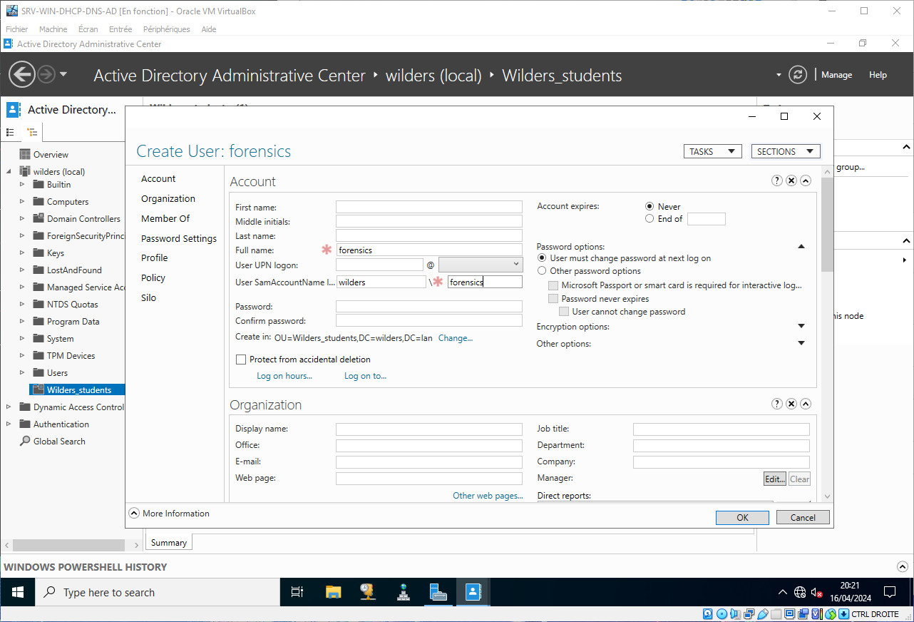

Nous allons pour terminer ajouter l'Utilisateur au Groupe

Clique-droit sur l'Utilisateur puis `Add to group`

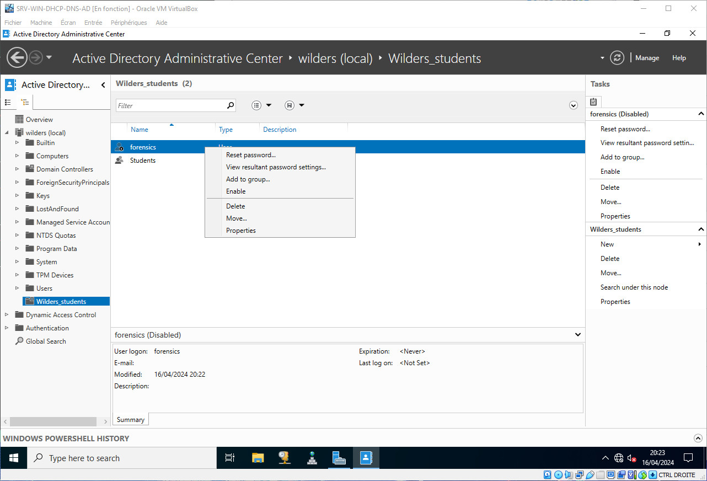

Cliquez sur `Locations`

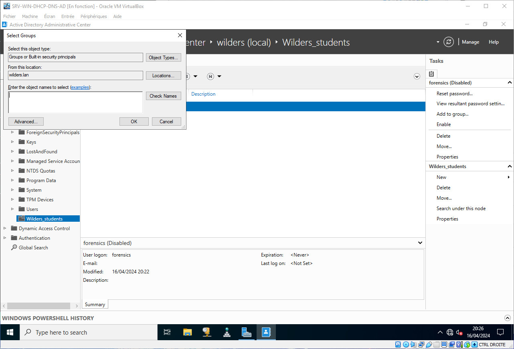

Développez l'arborescence du Domain AD

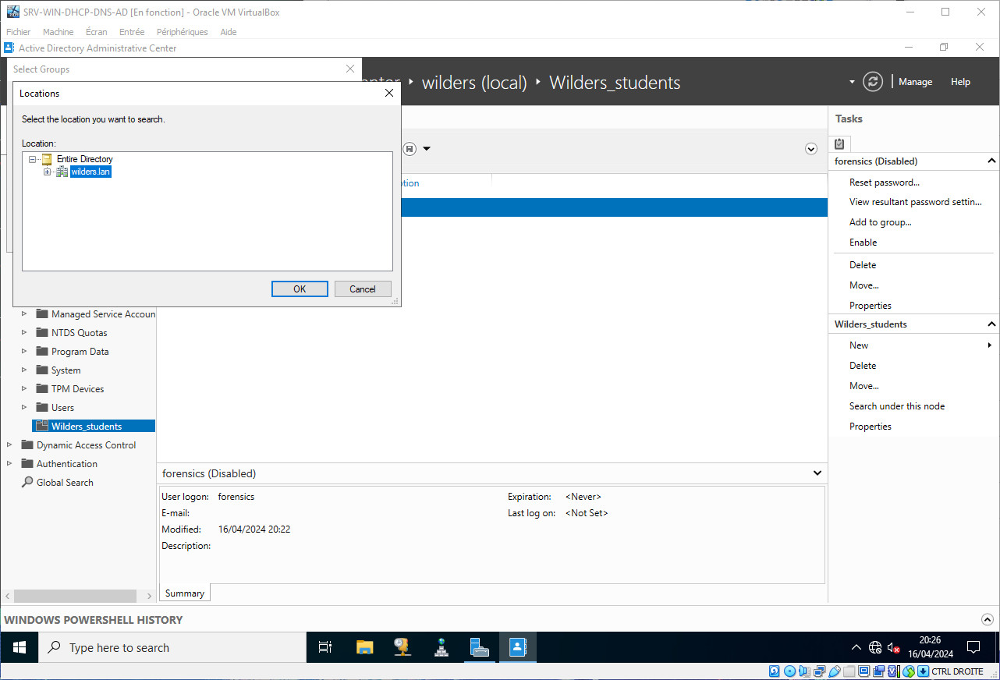

Sélectionnez l'Unité Organisationnelle puis `OK`

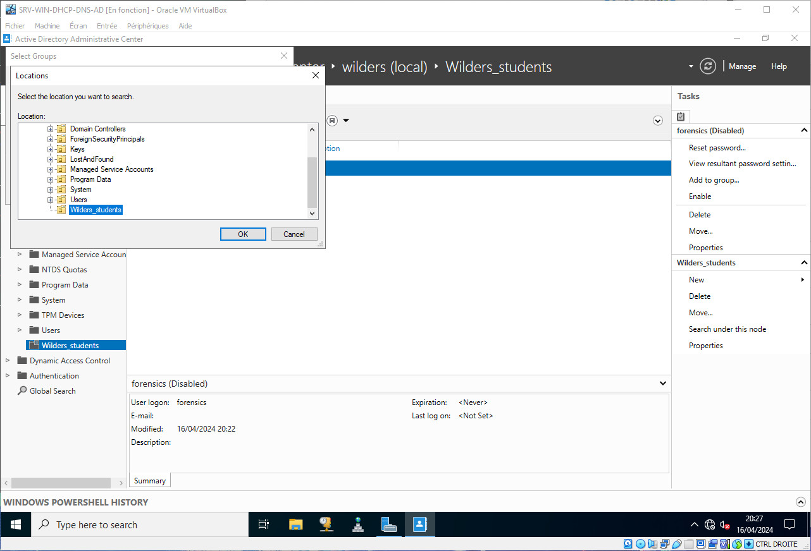

Remplissez le champ `Enter the object names to select` puis cliquez sur `Check names`

Si l'objet existe, il va être souligné

Cliquez sur `OK`

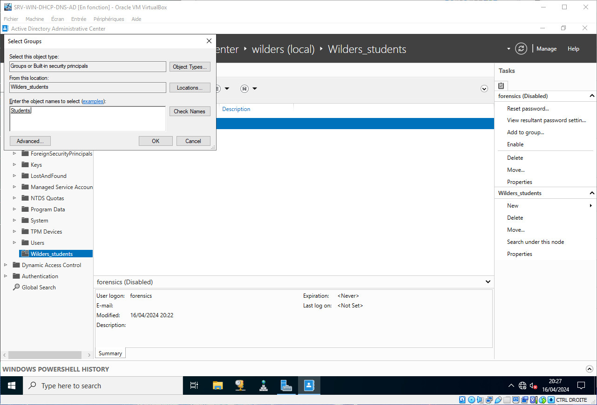

Après vérification, votre Utilisateur a bien été ajouté au Groupe

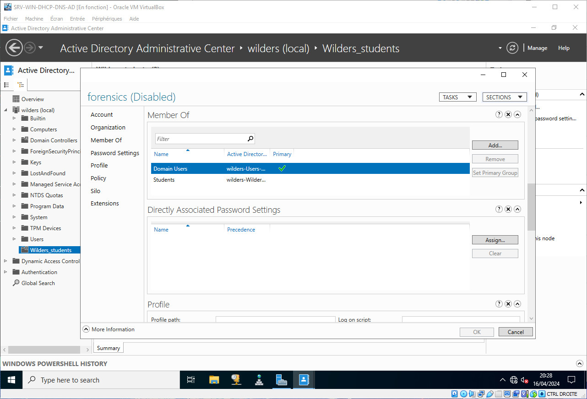