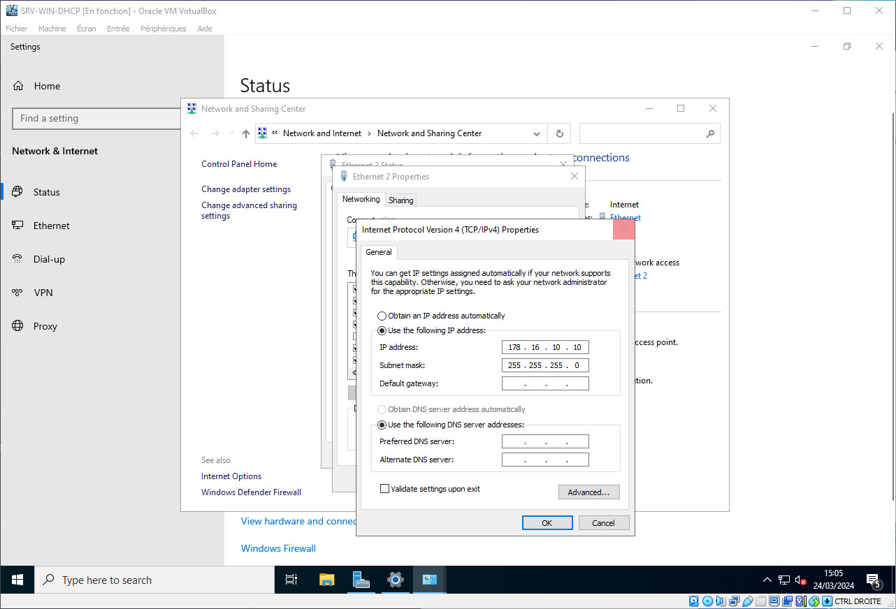
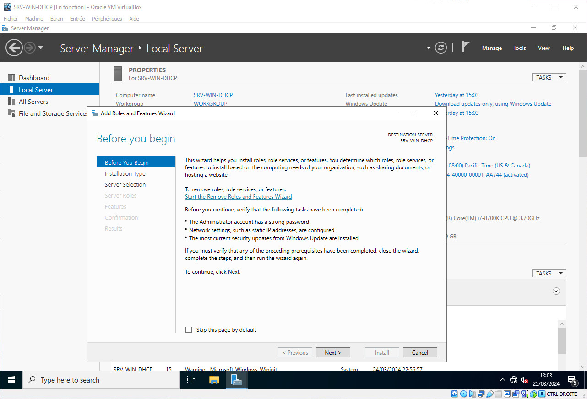
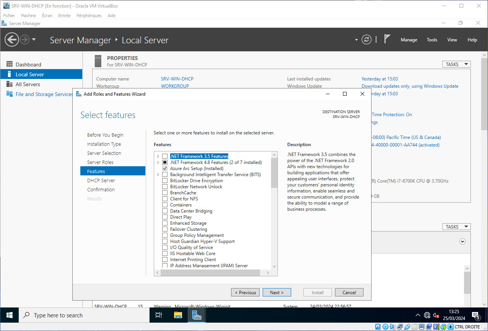
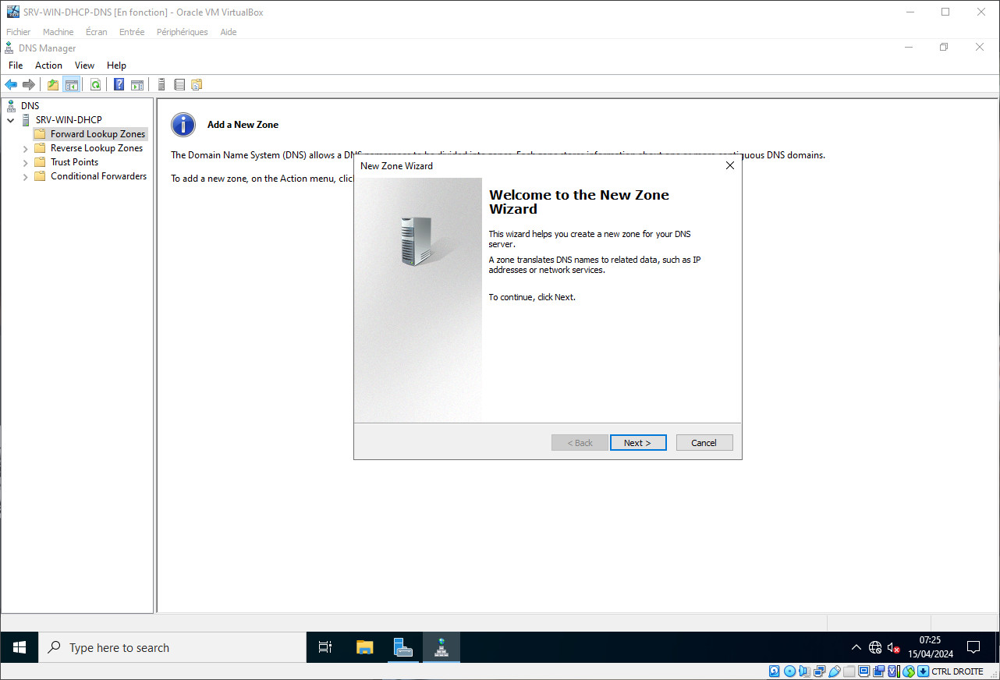
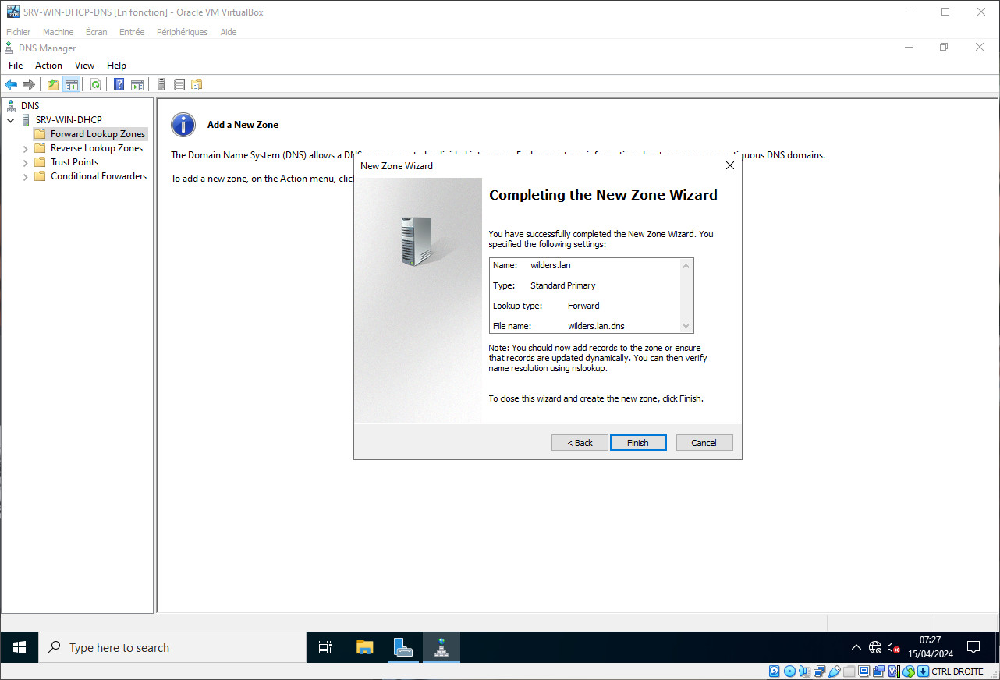

# DNS sur Windows Server

## Présentation

Le serveur DNS agit comme un annuaire que consulte un ordinateur au moment d'accéder à un autre ordinateur via un réseau. Autrement dit, le serveur DNS est ce service qui permet d'associer à site web (ou un ordinateur connecté ou un serveur) une adresse IP, comme un annuaire téléphonique permet d'associer un numéro de téléphone à un nom d'abonné.

## Mise en contexte

Pour notre exemple, nous prendrons des machines virtuelles, le serveur sous Windows Server 2022 (SRV-WIN-DHCP), le client sous Windows 10 Pro (CLI-WIN-DHCP). Afin d'éviter toutes interférences, nous allons procéder en réseau interne, donc dépourvue de connexion avec l'extérieur.

Bien que le réseau soit interne, nous avons tout de même effectuer les mises à jour disponibles avant désactivation des cartes NAT.

Il ne sera pas mentionné la question d'Active Directory, nous aborderons ces points dans un autre tutoriel.

NB. Nous travaillerons avec une version de Windows Server en langue US, mais si vous l'utilisez dans une autre langue les options sont identiques, seuls les termes utilisés seront différents.

Notre serveur est configuré sur l'adresse IP fixe : 178.16.10.10/24

## Installation du DNS sur Windows Server

Une fois les mises à jour effectuées, rendez-vous sur le Server Manager

En toute logique, celui-ci se lance au démarrage, mais vous pouvez le démarrer via la barre de recherche Windows.

Une fois le Server Manager lancé, rendez-vous sur `Manage` (en haut à droite) puis sélectionnez `Add Roles and Features`

Une fenêtre va s'ouvrir, elle attire votre attention sur certains pré-requis pour continuer
* Le compte administrator doit avoir un mot de passe résistant
* Votre configuration réseau doit être configurée avec un IP fixe
* Les mises à jours de sécurité Windows doivent avoir été faites

Choississez ensuite l'otion `Role-based or featured-based installation` puis cliquez sur `Next`

Le serveur étant déjà en local, il est donc déjà selectioné, cliquez sur `Next`

Nous rentrons alors dans le vif du sujet, vous devez ajouter le rôle `DNS Server`

Une nouvelle fenêtre s'ouvre, assurez-vous d'avoir l'option `Include management tools (if applicable)` cochée, puis cliquez sur `Add Features`

La fenêtre se ferme, le rôle `DNS Server` est bien coché, cliquez sur `Next`

Dans l'onglet `Features`, laissez comme c'est et cliquez sur `Next`

L'installation du rôle `DHCP Server` est presque terminée, cliquez sur `Next`

Cliquez sur `Install` pour finaliser

Une fois l'installation terminée, cliquez sur `Close`

Votre serveur DNS est installé, il vous reste désormais à le configurer.

## Configuration du DNS sur le Serveur

### Configuration du DNS

Pour accéder à la configuration du DNS, vous pouvez recherchez l'application via la barre Windows en tapant `DNS`

Il vous faut ensuite ajouter une zone pour faire autorité

Clique-droit sur `Forward Lookup Zones` puis sélectionez `New Zone`

L'assistant d'installation se lance, cliquez sur `Next`

Sélectionnez `Primary Zone` puis cliquez sur `Next`

Remplissez le champ `Zone Name`, `wilders.lan` dans notre exemple, puis cliquez sur `Next`

Sélectionnez `Create a new file with this file name`, le champ `wilders.lan.dns` est rempli automatiquement, puis cliquez sur `Next`

Sélectionnez l'option `Do not allow dynamic updates` puis cliquez sur `Next`

La configuration est terminé, cliquez sur `Finish` pour quitter l'assistant

La zone de DNS a bien été créé

### Configuration de l'annuaire inversé

Clique-droit sur `Reverse Lookup Zones` puis `New Zone`

L'assistant se lance, cliquez sur `Next`

Sélectionnez `Primary Zone` puis cliquez sur `Next`

Sélectionnez `IPv4 Reverse Lookup Zone` puis cliquez sur `Next`

Saisissez les 3 premiers octets de botre IP de serveur

Dans notre exmple, c'est `178.16.10` puis cliquez sur `Next`

Sélectionnez `Create a new file with this file name`, le champ `10.16.178.in-addr.arpa.dns` est rempli automatiquement, puis cliquez sur `Next`

Sélectionnez l'option `Do not allow dynamic updates` puis cliquez sur `Next`

La configuration est terminé, cliquez sur `Finish` pour quitter l'assistant

La zone inversée de DNS a bien été créé

### Configuration des hôtes

Clique-droit sur la fenêtre de la zone puis sélectionnez `New Host (A or AAAA)`

Remplissez les champs `Name` et `IP Address`

Dans notre cas, c'est `server` et l'IP `178.16.10.10`

Assure-vous de bien avoir la cas `Create associated pointer (PTR) record` cochée, puis cliquez sur `Add Host`

Même opération pour le Client

Les Hotes sont bien créés

### Configuration de l'Alias

De la même façon que pour les hôtes, clique-droit sur la fenêtre puis `New Alias (CNAME)`

Remplissez les champs `Alias name`

Dans notre exmple on met `dns`, puis à la ligne `Fully qualified doamin name`, cliquez sur `Browse`

Sélectionnez votre Serveur puis cliquez sur `OK`

Sélectionnez la zone de DNS puis cliquez sur `OK`

Sélectionnez votre DNS puis cliquez sur `OK`

Sélectionnez votre Hôte Serveur puis cliquez sur `OK`

Cliquez pour terminer sur `Apply` puis `OK`

Votre Alias de serveur est créé

Plus qu'à inscrire votre DNS par défaut dans vos paramètres de carte réseau IPv4 avec l'IP de votre Serveur, ici `178.16.10.10`

La configuration est terminée

## Vérification de la configuration DNS avec nslookup

Afin de vérifier la configuration, ouvrez le Command Prompt (ou Invite de Commande) en recherchant `cmd` dans la barre Windows

Vous n'avez ensuite qu'à faire votre recherche comme suit

Côté Serveur :

Côté Client :

On peut s'apercevoir ainsi que tout fonctionne

Enjoy :)