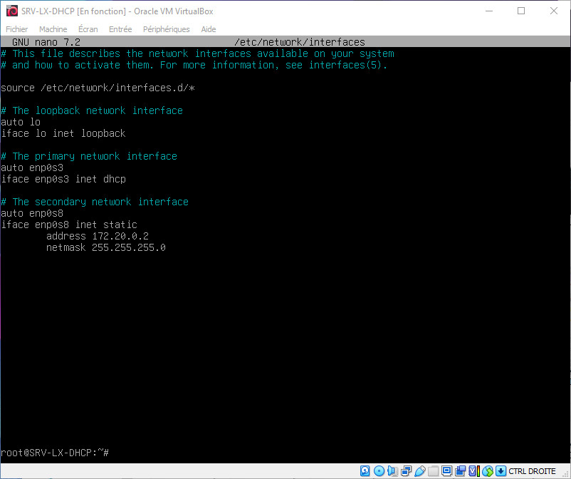
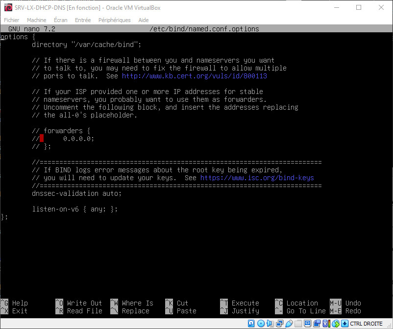
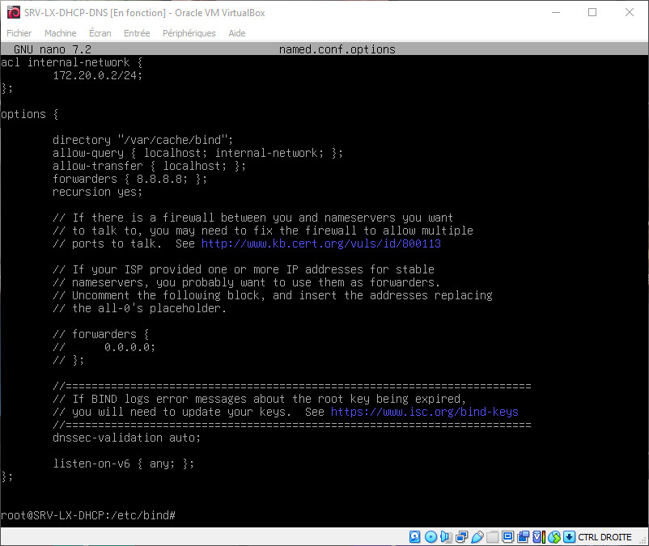
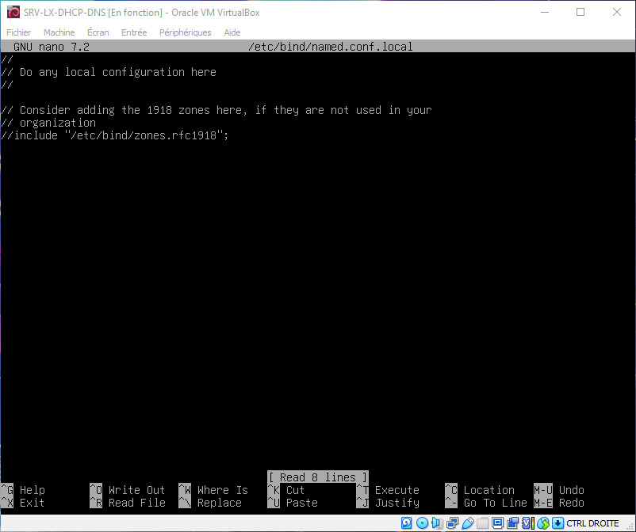
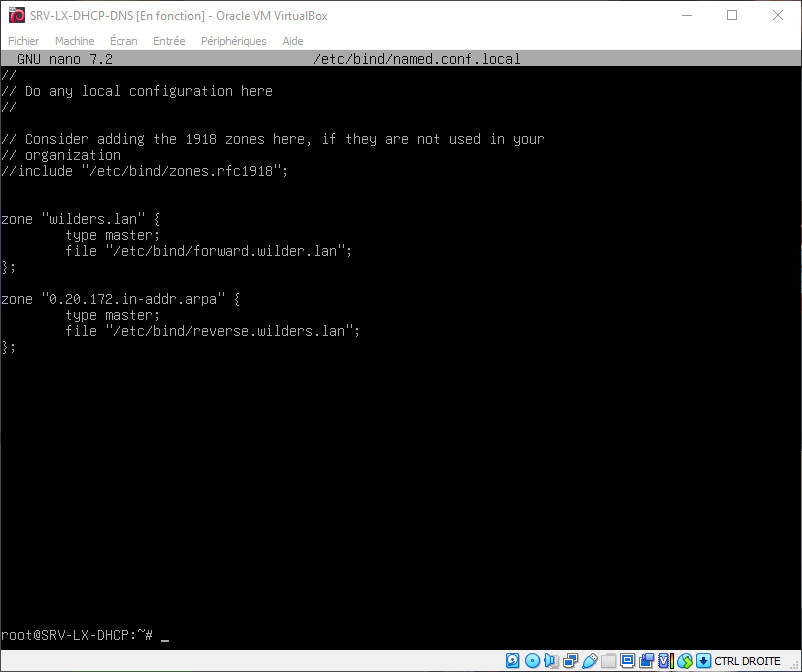
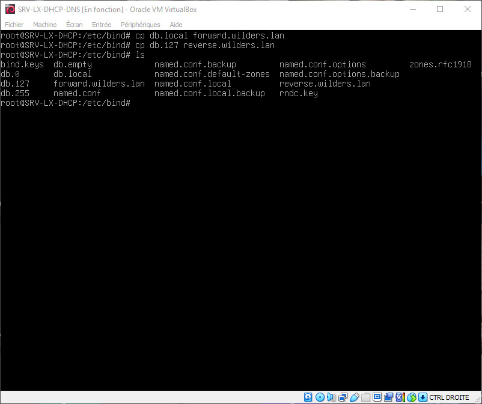
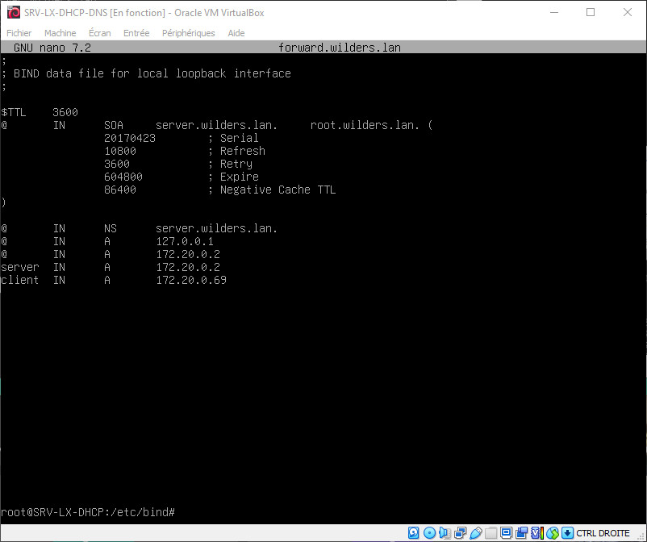
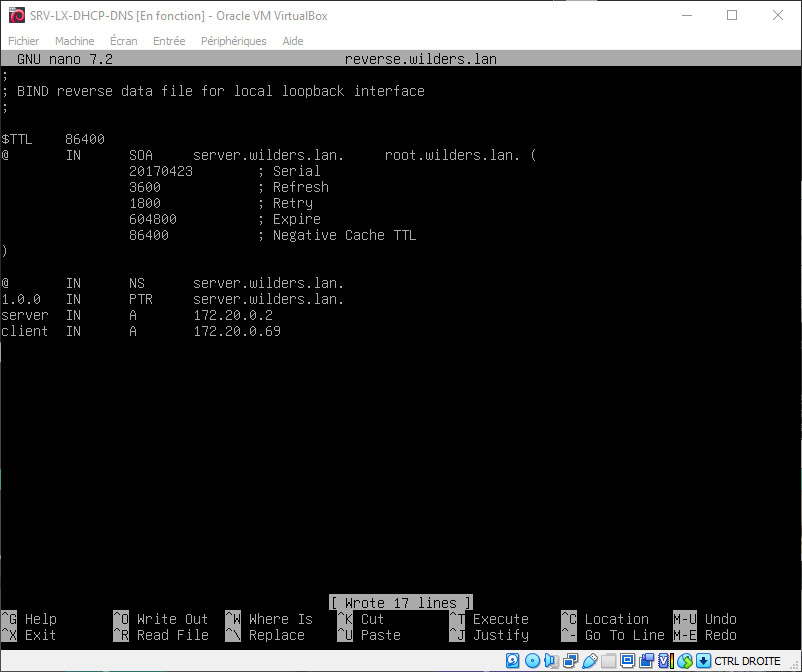
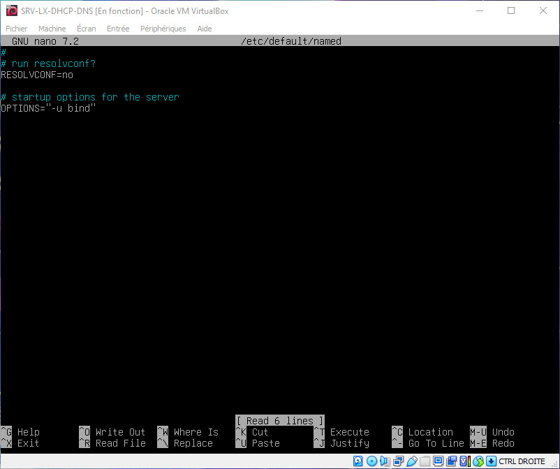
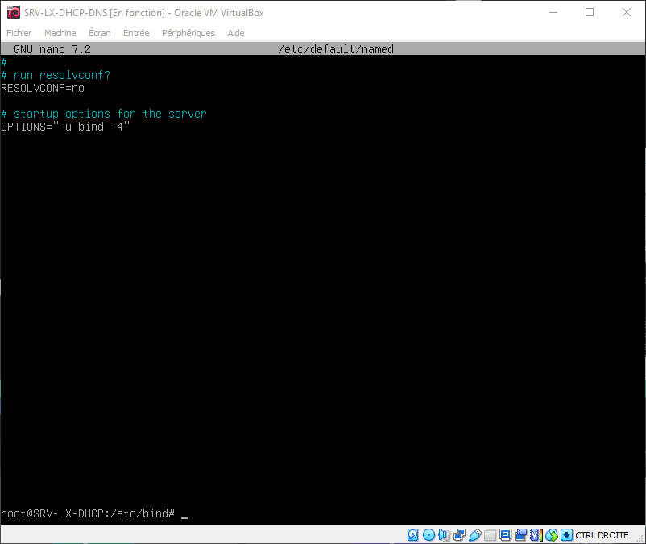

# Installation de DNS sur Serveur Linux

## Présentation

Le serveur DNS agit comme un annuaire que consulte un ordinateur au moment d'accéder à un autre ordinateur via un réseau. Autrement dit, le serveur DNS est ce service qui permet d'associer à site web (ou un ordinateur connecté ou un serveur) une adresse IP, comme un annuaire téléphonique permet d'associer un numéro de téléphone à un nom d'abonné.

## Mise en contexte

Pour notre exemple, nous prendrons des machines virtuelles, le serveur sous Windows Server 2022 (SRV-WIN-DHCP), le client sous Windows 10 Pro (CLI-WIN-DHCP). Afin d'éviter toutes interférences, nous allons procéder en réseau interne, donc dépourvue de connexion avec l'extérieur.

Bien que le réseau soit interne, nous avons tout de même effectuer les mises à jour disponibles avant désactivation des cartes NAT.

Il ne sera pas mentionné la question d'Active Directory, nous aborderons ces points dans un autre tutoriel.

NB. Nous travaillerons avec une version de Windows Server en langue US, mais si vous l'utilisez dans une autre langue les options sont identiques, seuls les termes utilisés seront différents.

Notre serveur est configuré sur l'adresse IP fixe : 172.20.0.2/24



## Installation de DNS

Avant toute chose, une petite mise à jour s'impose `apt update && apt upgrade -y`

Nous allons ensuite installer les paquet DNS sur notre serveur `apt install -y bind9 bind9utils bind9-doc dnsutils`

Petit rappel, mais pas des moindres, pensez avant de modifier un fichier à conserver une copie du fichier originel du type `fichier.backup`

Lorsque l'installation du paquet est terminée, nous devons modifier le fichier du paquet avec la commande `nano /etc/bind/named.conf.options` en y ajoutant nos paramètres de zone DNS comme suit

Avant :



Après :



Une fois cette étape achevée, nous allons modifer le fichier avec `nano /etc/bind/named.conf.local`

Avant :



Après :



Désormais, il nous faut créer les fichiers correspondant à la zone DNS et à la zone inversée dans le dossier `/etc/bind`

Nous allons créer les fichiers avec la commande `cp` :
* `forward.wilders.lan` à partir de `db.local`
* `reverse.wilders.lan` à partir de `db.127`



Puis on modifie le fichier avec `nano forward.wilders.lan`



Puis on modifie le fichier avec `nano reverse.wilders.lan`



Nous allons ensuite modifier le fichier situé dans `/etc/default/named`

Avant



Après :



Afin de prendre en compte tous les changemlents apportés, nous allons démarrer et activer le serviuce `named`

avec les commandes

```
systemctl start named
systemctl enable named
```
Et vérifier le status du service avec la commande `systemctl status named
`


